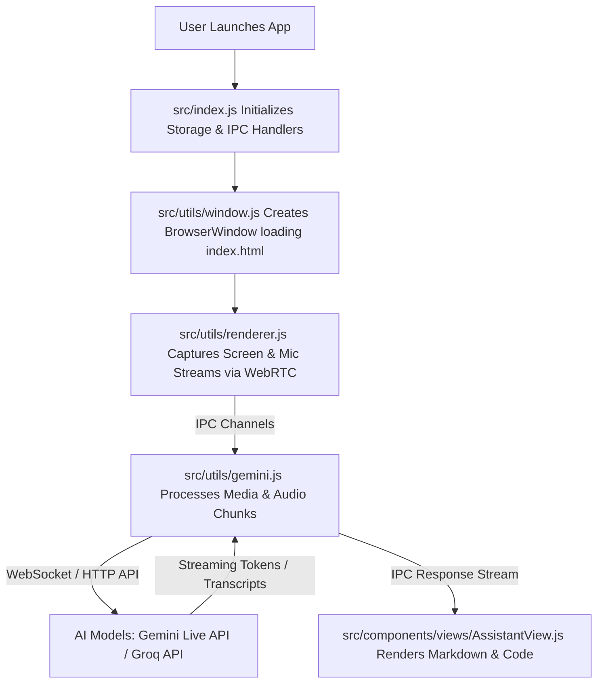

# Second Brain - Project Architecture & Workflow Guide

## 1. Overview & Purpose

**Second Brain** (a fork of `cheating-daddy`) is an **Electron-based real-time desktop AI assistant**. It captures screen content and audio streams in real-time, sending them to AI models (**Google Gemini Live API** and **Groq / Qwen**) to provide live interview coaching, meeting assistance, coding suggestions, and contextual AI responses in a customizable overlay window.

---

## 2. Application Entry Points

The application is built on Electron's process model, separated into **Main** (Node.js backend) and **Renderer** (Chromium UI frontend) processes.

| Process | Entry Point File | Responsibilities |
| :--- | :--- | :--- |
| **Main Process (Backend)** | [`src/index.js`](file:///c:/Users/yoges/Desktop/GitHub/Second-Brain/src/index.js) | Configured in [`package.json`](file:///c:/Users/yoges/Desktop/GitHub/Second-Brain/package.json) (`"main": "src/index.js"`). Handles app lifecycle, window management, operating system permissions, IPC handlers, local storage management, and background Gemini API WebSocket communication. |
| **Renderer Process (Frontend)** | [`src/index.html`](file:///c:/Users/yoges/Desktop/GitHub/Second-Brain/src/index.html) | Root HTML document loaded by the main window. Sets up theme CSS variables, imports markdown/syntax highlighting scripts (`marked.js`, `highlight.js`), mounts the root UI component [`<cheating-daddy-app>`](file:///c:/Users/yoges/Desktop/GitHub/Second-Brain/src/components/app/CheatingDaddyApp.js), and loads [`src/utils/renderer.js`](file:///c:/Users/yoges/Desktop/GitHub/Second-Brain/src/utils/renderer.js). |

---

## 3. End-to-End Workflow

### Detailed Execution Flow:
1. **Initialization:** [`src/index.js`](file:///c:/Users/yoges/Desktop/GitHub/Second-Brain/src/index.js) initializes local JSON storage via [`src/storage.js`](file:///c:/Users/yoges/Desktop/GitHub/Second-Brain/src/storage.js) (API keys, preferences, prompt profiles) and launches the Electron window via [`src/utils/window.js`](file:///c:/Users/yoges/Desktop/GitHub/Second-Brain/src/utils/window.js).
2. **Media Capture:** [`src/utils/renderer.js`](file:///c:/Users/yoges/Desktop/GitHub/Second-Brain/src/utils/renderer.js) uses WebRTC (`navigator.mediaDevices.getDisplayMedia` / `getUserMedia`) to capture desktop screen frames and microphone/speaker audio.
3. **Audio & Image Preparation:** Screen frames are formatted into base64 images at user-configured intervals, and audio is resampled into 24kHz raw PCM buffers.
4. **IPC Transmission:** `renderer.js` transmits media chunks to the main process via IPC channels (`gemini:send-audio`, `gemini:send-image`).
5. **AI Inference:** [`src/utils/gemini.js`](file:///c:/Users/yoges/Desktop/GitHub/Second-Brain/src/utils/gemini.js) prepends system prompt templates from [`src/utils/prompts.js`](file:///c:/Users/yoges/Desktop/GitHub/Second-Brain/src/utils/prompts.js) based on the active profile (e.g. Interview Candidate, Developer) and streams payloads to Google Gemini Live API or Groq endpoints.
6. **Live UI Rendering:** Streamed tokens from the AI are pushed back to the renderer process via IPC, where [`src/components/views/AssistantView.js`](file:///c:/Users/yoges/Desktop/GitHub/Second-Brain/src/components/views/AssistantView.js) renders real-time formatted text and code blocks.

---

## 4. Component Directory & File Responsibilities ("What is Used for What")

### A. Root & Core Config Files
* [`package.json`](file:///c:/Users/yoges/Desktop/GitHub/Second-Brain/package.json): Defines dependencies (`@google/genai`, `electron`, `ws`), project metadata, and execution scripts (`npm start`).
* [`forge.config.js`](file:///c:/Users/yoges/Desktop/GitHub/Second-Brain/forge.config.js): Electron Forge configuration for packaging and building platform installers (Windows, macOS, Linux).
* [`src/index.js`](file:///c:/Users/yoges/Desktop/GitHub/Second-Brain/src/index.js): Main process entry point. Coordinates window creation, IPC handlers, app lifecycle events, and OS audio capture triggers.
* [`src/index.html`](file:///c:/Users/yoges/Desktop/GitHub/Second-Brain/src/index.html): Main window HTML template defining theme variables and mounting root UI Web Components.
* [`src/storage.js`](file:///c:/Users/yoges/Desktop/GitHub/Second-Brain/src/storage.js): Local JSON file storage manager (`config.json`, `credentials.json`, `preferences.json`, `keybinds.json`, `limits.json`) residing in OS Application Support directories.

### B. Backend Utilities (`src/utils/`)
* [`src/utils/gemini.js`](file:///c:/Users/yoges/Desktop/GitHub/Second-Brain/src/utils/gemini.js): Main process backend AI manager. Controls Gemini Live WebSocket connections, Groq API text completions, conversation history tracking, and session reconnection logic.
* [`src/utils/window.js`](file:///c:/Users/yoges/Desktop/GitHub/Second-Brain/src/utils/window.js): Electron window controller. Configures frameless window attributes, transparency, click-through states, window positioning, and global hotkeys.
* [`src/utils/renderer.js`](file:///c:/Users/yoges/Desktop/GitHub/Second-Brain/src/utils/renderer.js): Renderer process bridge. Captures canvas screen frames, processes Web Audio API nodes, listens for keyboard events, and invokes storage IPC methods.
* [`src/utils/prompts.js`](file:///c:/Users/yoges/Desktop/GitHub/Second-Brain/src/utils/prompts.js): Prompt template library containing specialized system prompts for technical interviews, coding, customer support, and general assistance.
* [`src/utils/transportLogger.js`](file:///c:/Users/yoges/Desktop/GitHub/Second-Brain/src/utils/transportLogger.js): Transport logging helper for session debugging.
* [`src/audioUtils.js`](file:///c:/Users/yoges/Desktop/GitHub/Second-Brain/src/audioUtils.js): Native platform audio capturing and debug file formatting utilities.

### C. Frontend Web Components (`src/components/`)
Built with modular custom HTML Web Components:

* **Application Shell:**
  * [`src/components/app/CheatingDaddyApp.js`](file:///c:/Users/yoges/Desktop/GitHub/Second-Brain/src/components/app/CheatingDaddyApp.js): Root UI component managing active view state, navigation, onboarding checks, and shortcut routing.
  * [`src/components/app/AppHeader.js`](file:///c:/Users/yoges/Desktop/GitHub/Second-Brain/src/components/app/AppHeader.js): Application top bar for switching views, selecting active profiles, displaying status badges, and window control buttons.

* **Views (`src/components/views/`):**
  * [`MainView.js`](file:///c:/Users/yoges/Desktop/GitHub/Second-Brain/src/components/views/MainView.js): Main dashboard featuring start/stop assistant controls, live screen/video preview, quick prompt input, and manual screenshot triggers.
  * [`AssistantView.js`](file:///c:/Users/yoges/Desktop/GitHub/Second-Brain/src/components/views/AssistantView.js): Real-time chat feed displaying streaming AI responses, live transcription, and syntax-highlighted code blocks.
  * [`CustomizeView.js`](file:///c:/Users/yoges/Desktop/GitHub/Second-Brain/src/components/views/CustomizeView.js): Configuration settings interface for API key management, screenshot frequency, image quality, audio devices, and hotkeys.
  * [`AICustomizeView.js`](file:///c:/Users/yoges/Desktop/GitHub/Second-Brain/src/components/views/AICustomizeView.js): Prompt and AI personality customization settings page.
  * [`HistoryView.js`](file:///c:/Users/yoges/Desktop/GitHub/Second-Brain/src/components/views/HistoryView.js): Conversation logs and past session history viewer.
  * [`OnboardingView.js`](file:///c:/Users/yoges/Desktop/GitHub/Second-Brain/src/components/views/OnboardingView.js): First-time onboarding wizard for setting up API credentials.
  * [`HelpView.js`](file:///c:/Users/yoges/Desktop/GitHub/Second-Brain/src/components/views/HelpView.js): Usage guide, FAQs, and keyboard shortcut reference.

---

## 5. Technology Stack & Key Dependencies

* **Desktop Runtime:** Electron 30 with Electron Forge (`electron-forge`)
* **UI Layer:** HTML5, Vanilla JavaScript Web Components, Vanilla CSS (CSS Custom Properties)
* **SDKs & Libraries:** 
  * `@google/genai` (Google Gemini SDK)
  * `ws` (WebSocket connection handling)
  * `marked` (Client-side Markdown parser)
  * `highlight.js` (Client-side Code Syntax Highlighting)
