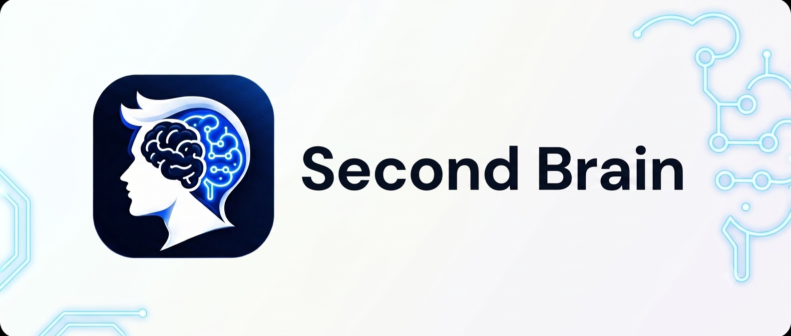

# Second Brain

**Second Brain** is a high-performance, real-time AI interview copilot and meeting assistant that provides discreet contextual answers, working code, and live guidance using screen capture and ultra-fast audio transcription.



## Features

- **⚡ Blazing-Fast Speech Transcription**: Real-time voice capture powered by Groq's `whisper-large-v3-turbo` with sub-second response times.
- **🔑 Dynamic Multi-Key Cycling**: Enter multiple Groq API keys with automatic round-robin and rate-limit (HTTP 429) failover so you never run out of quota during long interviews.
- **💻 Direct Code & Problem Solving**: Generates clean, production-ready code for LeetCode, DSA, System Design, SQL, and technical interview questions immediately without disclaimers.
- **🖥️ Multimodal Screen & Audio Memory**: Captures screen context and audio dialogue into a unified 40-turn memory window.
- **🛡️ Noise Gate & Anti-Hallucination**: Fine-tuned Voice Activity Detection (VAD) with silence artifact filtering to eliminate phantom responses.
- **🪟 Transparent Overlay**: Discreet, always-on-top window with click-through and stealth modes.
- **🎯 Multiple Profiles**: Job Interview, Sales Call, Business Meeting, Presentation, Negotiation, Exam.

## Quick Start

1. **Clone the repository**:

    ```bash
    git clone https://github.com/yogesh-saini/Self-Helping-Tool.git
    cd Self-Helping-Tool
    ```

2. **Install Dependencies**:

    ```bash
    npm install
    ```

3. **Run the App**:

    ```bash
    npm start
    ```

4. **Add Your Groq API Keys**:
    - Get one or more free API keys from [Groq Console](https://console.groq.com/keys).
    - Add your keys in the app settings (you can add multiple keys for continuous failover).
    - Click **Start Session** and you're ready!

## Keyboard Shortcuts

| Action                   | Shortcut (Windows/Linux)   | Shortcut (macOS)          |
| ------------------------ | -------------------------- | ------------------------- |
| **Move Window**          | `Ctrl + Arrow Keys`        | `Cmd + Arrow Keys`        |
| **Toggle Visibility**    | `Ctrl + \`                 | `Cmd + \`                 |
| **Toggle Click-Through** | `Ctrl + M`                 | `Cmd + M`                 |
| **Next Response**        | `Ctrl + ]`                 | `Cmd + ]`                 |
| **Previous Response**    | `Ctrl + [`                 | `Cmd + [`                 |
| **Next Step**            | `Ctrl + Enter`             | `Cmd + Enter`             |
| **Scroll Up / Down**     | `Ctrl + Shift + Up / Down` | `Cmd + Shift + Up / Down` |
| **Emergency Erase**      | `Ctrl + Shift + E`         | `Cmd + Shift + E`         |

## Audio Architecture

- **Speech Transcription**: Groq `whisper-large-v3-turbo` with real-time VAD.
- **Dual-Capture Audio**: Mixed system loopback (interviewer's voice) + microphone (candidate's voice).
- **Inference Models**: `qwen/qwen3.6-27b`, `openai/gpt-oss-20b`, `openai/gpt-oss-120b`, and customizable models.

## Requirements

- Node.js 18+
- Groq API Key (Free tier supported)
- Screen recording and Microphone permissions

## Author & Maintainer

- **Yogesh Saini**
- Repository: [Self-Helping-Tool](https://github.com/yogesh-saini/Self-Helping-Tool)
